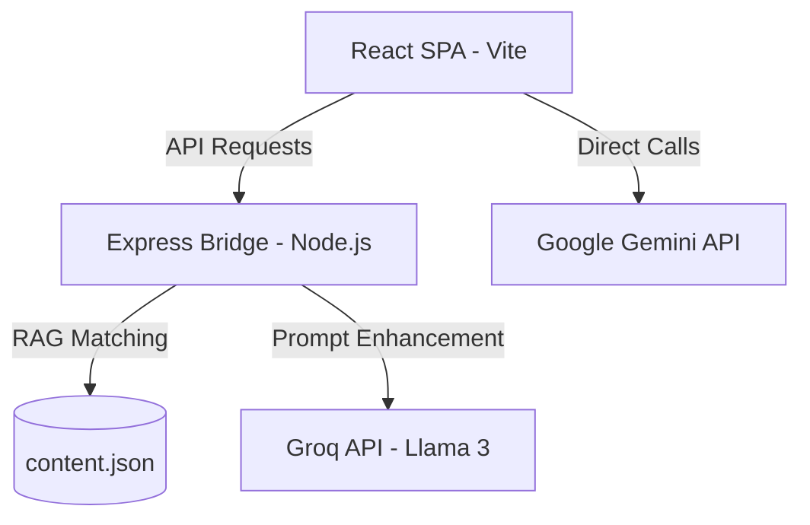

# System Architecture - Guidorizzi App

## Overview
The application follows a **Bridge Architecture** where a React-based Single Page Application (SPA) communicates with a lightweight Express backend proxy ("Bridge").

## High-Level Diagram

## Layers

### 1. Presentation Layer (Frontend)
- **Components**: `src/components/` (Chat, Quiz, Flashcards).
- **State Management**: `src/context/` (AppContext, ThemeContext).
- **Navigation**: Custom view-switching logic in `App.tsx`.

### 2. Service Layer (Bridge)
- **Entry Point**: `server.js`
- **Middleware**: Auth, Rate Limiting, Security (Helmet).
- **RAG Engine**: Performs semantic/textual matching against the localized `content.json`.

### 3. Intelligence Layer
- **Prompting**: `src/services/prompts.js` and `promptTemplates.js`.
- **Validation**: `src/services/answerValidator.js`.
